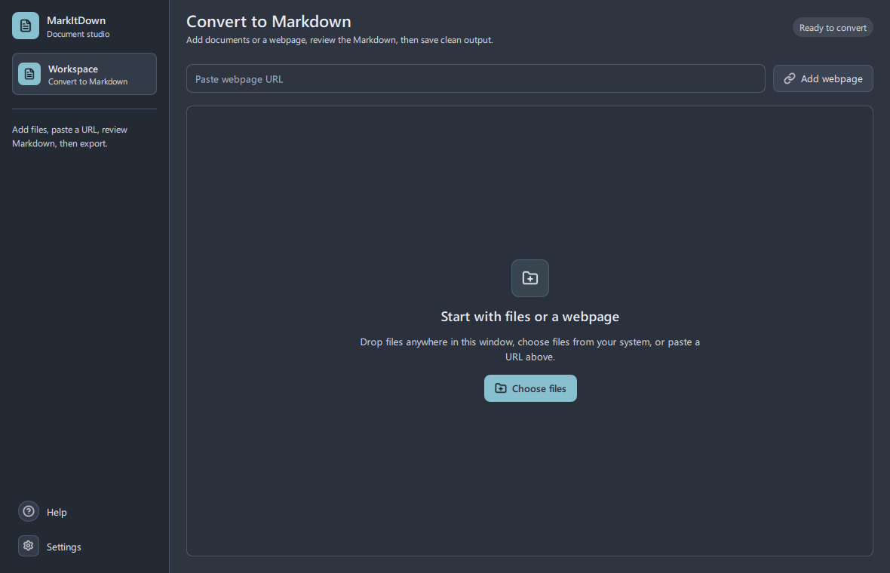
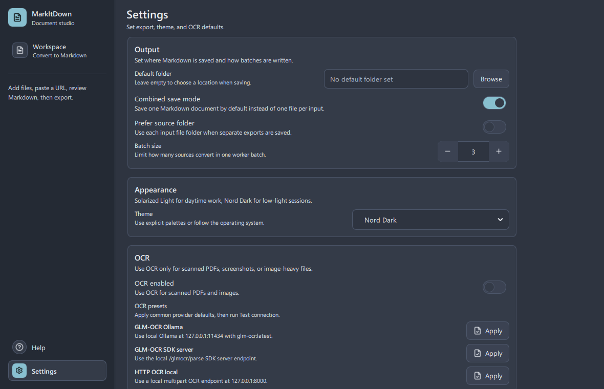
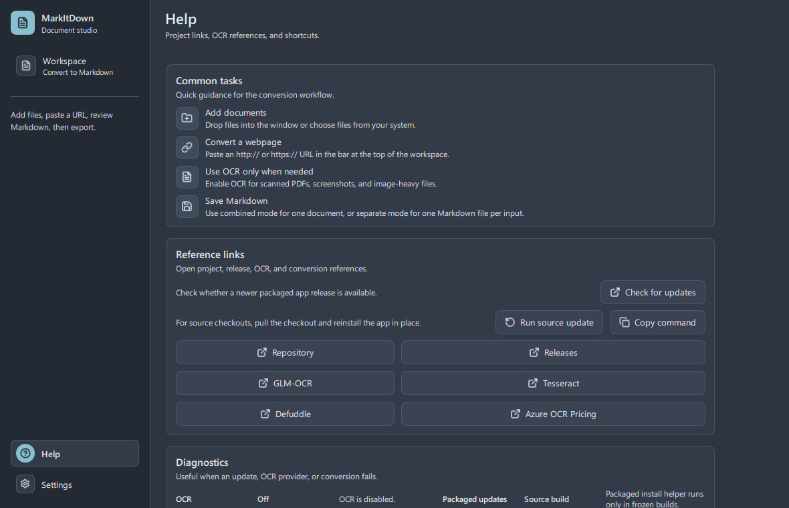

[English](README.md) | [简体中文](README_zh.md) | [繁體中文](README_zh_TW.md)


# MarkItDown GUI Wrapper — 简体中文增强版

> Forked from [imadreamerboy/markitdown-gui](https://github.com/imadreamerboy/markitdown-gui), with full Simplified Chinese UI support.

A desktop GUI for `MarkItDown`, built with `PySide6` and official Qt Quick Controls/QML.
It focuses on fast multi-file conversion to Markdown with a modern, native-styled desktop interface.



More screenshots:

| Settings | Help and updates |
|----------|------------------|
|  |  |

## Features

- Queue-based file workflow with drag and drop.
- Paste website URLs and convert article content to Markdown with the hosted Defuddle API.
- Batch conversion with start, pause/resume, cancel, and progress feedback.
- Results view with per-file selection and Markdown preview.
- Preview modes: rendered Markdown view and raw Markdown view.
- Save modes: export as one combined file or separate files.
- Quick actions: copy Markdown, save output, retry failed conversions, back to queue, start over.
- Optional OCR for scanned PDFs and image files, with selectable `Azure + Tesseract`, `GLM-OCR`, and generic `HTTP OCR` providers.
- Settings for output folder, save mode, source-folder saves, batch size, OCR, and theme mode (light/dark/system).
- Help view with project links, OCR references, conversion references, and keyboard shortcuts.
- **🌐 Multi-language support**: English, 简体中文, 繁體中文 — switch from Settings → Appearance → Language (restart required).

### 🌐 Switching Languages

1. Open **Settings** from the sidebar
2. Under **Appearance**, find the **Language** dropdown
3. Select **English**, **简体中文**, or **繁體中文**
4. **Restart the application** for the change to take effect

The language preference is saved between sessions. All UI elements — sidebar, buttons, labels, tooltips, and settings — are fully translated.


## Installation

Download prebuilt binaries from [Releases](https://github.com/nfeuism/markitdown-gui/releases), or run from source.

### Release assets

- Windows: use `MarkItDown-Windows-Setup-<version>.exe` for the normal installer, or `MarkItDown-Windows-<version>.zip` for a portable folder.
- Linux: use `MarkItDown-Linux-<version>.AppImage` for a single-file app, or `MarkItDown-Linux-<version>.zip` for a portable folder.
- macOS: use `MarkItDown-macOS-<version>.dmg` and drag the app into Applications.

### Updating

- Packaged desktop builds are updated from [Releases](https://github.com/imadreamerboy/markitdown-gui/releases). The in-app update check reads the latest GitHub release, shows a short release-note summary, and prefers the asset for the current operating system. Help shows the selected asset, size, checksum availability, action, and restart behaviour before install.
- Windows and Linux packaged builds can start an in-app install when the preferred asset is a `.zip`: the app shows install progress, downloads the archive, verifies SHA256 when release metadata is available, prepares an external helper, closes, replaces the app folder, restarts, and rolls back if replacement fails. The helper records the last update result and rollback backup path in Help -> Diagnostics on the next launch, with a direct action to open the backup folder when it still exists. macOS packaged builds download, verify, and open the `.dmg` for manual drag-to-Applications installation.
- The Windows installer and Linux AppImage are additional first-install download options; the in-app self-update path intentionally keeps using the portable `.zip` asset.
- Release builds publish a `markitdown-release-manifest.json` with platform, size, and SHA256 metadata for each package.
- Source checkouts can update in place from the Help view with `Run source update`, or from a terminal:

```sh
python -m markitdowngui.utils.source_updater
```

The source updater first checks that the checkout has no tracked local changes, then runs `git pull --ff-only` and reinstalls the app in editable mode with `uv` when available or `pip` otherwise. The Help view shows a restart action after it finishes.

### Support bundles

The Help view shows a compact readiness summary for OCR, packaged updates, source updates, update checks, and logs. Copy diagnostics includes that readiness summary with home paths and obvious secret values redacted. The view can also export a support bundle for issue reports with a diagnostics report, sanitised settings, and capped recent log tails; raw recent file paths, output paths, and obvious secret values are excluded or redacted.

### Settings profiles

The Settings view can export or import a portable JSON profile for OCR, update, conversion, theme, language, and save-mode preferences. Profiles include provider endpoints and environment variable names, but exclude recent files, recent outputs, window state, and default output folders.

### Prerequisites

- Python `3.10+`
- `uv` (recommended)

Install dependencies:

```sh
uv sync
```

Alternative:

```sh
pip install -e .[dev]
```

### OCR Notes

- OCR is optional and disabled by default.
- `Azure + Tesseract` uses Azure Document Intelligence first when configured, then Tesseract as its local fallback.
- `GLM-OCR` is available as a separate OCR provider for PDFs and images. It can fall back to another configured provider if selected in Settings.
- `HTTP OCR` is a generic integration point for local or self-hosted OCR servers. The app sends a multipart `POST` with a `file` part, optional `model` field, and optional `Authorization: Bearer ...` header read from the configured environment variable. JSON responses can use `markdown`, `text`, `result`, `content`, or `output`; plain text responses are used directly.
- Preserved PDF images keep using the existing image-preservation pipeline. With `Azure + Tesseract`, OCR runs inside that helper. With `GLM-OCR` or `HTTP OCR`, the app preserves images first and appends OCR text from the selected provider.
- Settings shows one-click OCR presets for common local stacks, plus provider-specific setup actions for opening docs or copying safe setup snippets. **Validate OCR** checks the required fields before a batch starts, and **Test connection** checks live provider connectivity without uploading user documents.
- GLM-OCR offers three modes in Settings:
  - `Official API`: easiest zero-setup path, reads `ZHIPU_API_KEY` or `GLMOCR_API_KEY` from the environment.
  - `Ollama`: easiest local path. The GUI calls Ollama's native `/api/generate` endpoint directly, with defaults `127.0.0.1:11434` and `glm-ocr:latest`.
  - `SDK Server (vLLM / SGLang)`: stronger self-hosted path. Point the app at an existing `/glmocr/parse` endpoint. Default: `http://127.0.0.1:5002/glmocr/parse`.
- The packaged desktop app does not bundle the GLM-OCR self-hosted runtime stack (`torch`, `transformers`, `vLLM`, `SGLang`, and related server/runtime pieces stay external).
- The project depends on `glmocr==0.1.4` for client-side Official API and SDK Server connectivity. Ollama is called directly over HTTP.
- Local OCR requires a system `tesseract` binary. Install it from the [official Tesseract project](https://github.com/tesseract-ocr/tesseract). If it is not on your `PATH`, set the executable path in Settings.
- Azure OCR requires an Azure Document Intelligence endpoint in Settings.
- Azure Document Intelligence pricing includes [500 free pages per month](https://azure.microsoft.com/en-us/products/ai-foundry/tools/document-intelligence#Pricing) at the time of writing.
- For API-key auth, set `AZURE_OCR_API_KEY`.
- If `AZURE_OCR_API_KEY` is not set, Azure OCR falls back to Azure identity credentials supported by `DefaultAzureCredential`.
- GLM-OCR project reference: [zai-org/GLM-OCR](https://github.com/zai-org/GLM-OCR)

### Recommended Local Hosting

For normal local use, the easiest path is Ollama. For stronger self-hosted deployments, use the GLM-OCR SDK Server with vLLM or SGLang.

### Ollama

1. Install Ollama.
2. Pull the model:

```sh
ollama pull glm-ocr:latest
```

3. Start the service if it is not already running:

```sh
ollama serve
```

4. In this app, choose `GLM-OCR` -> `Ollama`.
5. Keep the defaults unless you changed them:
   - host: `127.0.0.1`
   - port: `11434`
   - model: `glm-ocr:latest`

### SDK Server

1. Create a separate Python environment for GLM-OCR.
2. Install `glmocr[selfhosted,server]` in that environment.
3. Start a local `vLLM` or `SGLang` backend for `zai-org/GLM-OCR`.
4. Start the SDK server:

```sh
python -m glmocr.server --config config.yaml
```

5. In this app, choose `GLM-OCR` -> `SDK Server (vLLM / SGLang)` and keep `http://127.0.0.1:5002/glmocr/parse`.

Minimal server-side `config.yaml`:

```yaml
pipeline:
  maas:
    enabled: false
  ocr_api:
    api_host: 127.0.0.1
    api_port: 8080
```

The official GLM-OCR docs show the full Ollama, `vLLM`, and `SGLang` setup commands:

- [Official Ollama deployment guide](https://github.com/zai-org/GLM-OCR/blob/main/examples/ollama-deploy/README.md)
- [Self-hosted SDK Server + Client Guide](https://github.com/zai-org/GLM-OCR/blob/main/examples/self-host/README.md)
- [GLM-OCR README](https://github.com/zai-org/GLM-OCR)

### Website URL Notes

- Website conversion uses the hosted [Defuddle](https://defuddle.md/) API.
- The app sends the pasted `http://` or `https://` URL to `https://defuddle.md/<url>` and stores the returned Markdown in the normal results view.
- Defuddle responses typically include YAML frontmatter metadata at the top when available.
- According to the [Defuddle Terms](https://defuddle.md/terms), unauthenticated requests are limited to `1,000` requests per month per IP address as of March 14, 2026.
- Because requests are sent directly from the desktop app, that free-tier limit applies to the user's own network IP.
- Website conversion requires an internet connection and depends on the external Defuddle service being available.

## Run the App

```sh
uv run python -m markitdowngui.main
```

## Keyboard Shortcuts

- `Ctrl+O`: Open files
- `Ctrl+S`: Save output
- `Ctrl+C`: Copy output
- `Ctrl+R`: Retry failed conversions
- `Ctrl+P`: Pause/resume
- `Ctrl+B`: Start conversion
- `Ctrl+L`: Clear queue
- `Ctrl+K`: Show shortcuts
- `Esc`: Cancel conversion

## Build a Standalone Executable

```sh
uv pip install -e .[dev]
pyinstaller MarkItDown.spec --clean --noconfirm
```

The default spec builds an `onedir` app in `dist/MarkItDown/`. On macOS it also emits `dist/MarkItDown.app`.
Release workflows package Windows and Linux builds into platform-specific `.zip` artifacts, add a Windows Inno Setup `.exe` installer, add a Linux `.AppImage`, and package macOS builds into a drag-to-Applications `.dmg` from the `.app` bundle. The macOS bundle is signed with `MACOS_CODESIGN_IDENTITY` when configured, otherwise it uses ad-hoc signing. Each release also includes `markitdown-release-manifest.json` for update metadata and checksums.
That build intentionally excludes the GLM-OCR self-hosted runtime stack; local hosting stays external to the GUI.

## License

Licensed under the **MIT License**.

The app uses `PySide6`/Qt under Qt's LGPL/commercial licensing model. The previous `PySide6-Fluent-Widgets` dependency has been removed.

## Contributing

1. Fork the repository and create a branch.
2. Install dev dependencies:

```sh
uv pip install -e .[dev]
```

3. Make your changes.
4. Run tests:

```sh
uv run pytest -q
```

5. Open a pull request with a clear summary.

## Credits

- MarkItDown ([MIT License](https://opensource.org/licenses/MIT))
- PySide6 ([LGPLv3 License](https://www.gnu.org/licenses/lgpl-3.0.html))
- Qt Quick Controls ([Qt documentation](https://doc.qt.io/qt-6/qtquickcontrols-index.html))

